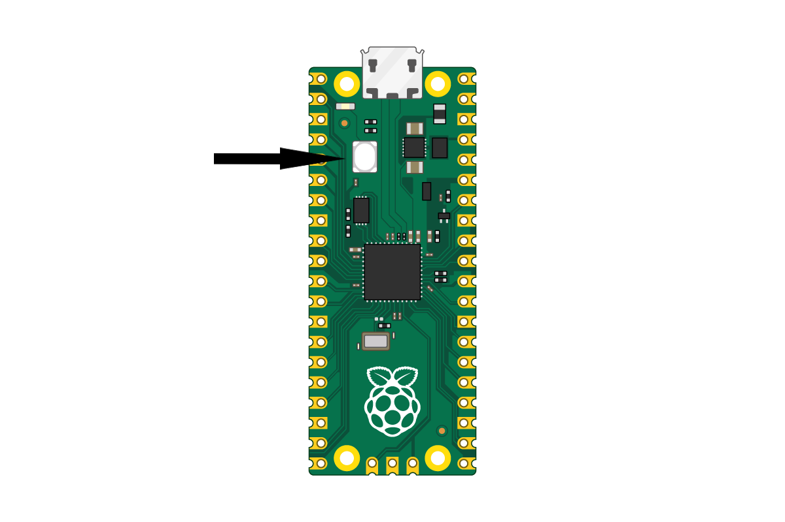

# micro-ROS module for Raspberry Pi Pico W using Pico SDK

This tutorial explains how to compile the firmware for the Raspberry Pi Pico W, flash it to the microcontroller, and install and use the `micro_ros_agent` for communication.

> Note: This can be used with the Raspberry Pi Pico by using the `uart_transport` instead of the `udp_transport`.

## Getting Started

There are two parts of the enviroment in order for us to use micro-ROS in the Raspberry Pi Pico W: the frimware and the agent.

- Frimware: The actual code that runs in the micro-controller, defines the nodes and topics that will be available, and publishes and/or subscribes to those topics.

- Agent: The communication channel for the micro-controller to interact with a ROS enviroment. Usually, it runs on the host computer, giving access and exposing the nodes and topics from defined in the frimware.

> Note: The ```ROS_DOMAIN_ID``` is also defined by the Raspberry Pi Pico W.

## Frimware Installation

### 1. Configure Environment

The micro-ROS precompiled library is built using `arm-none-eabi-gcc` 9.3.1. A compatible toolchain version is required when building the micro-ROS project.
You can specify a compiler path with the following command:

```bash
# Configure environment
echo "export PICO_TOOLCHAIN_PATH=..." >> ~/.bashrc
source ~/.bashrc
```

### 2. Install Pico SDK

First, make sure the Pico SDK is properly installed and configured:

```bash
# Install dependencies
sudo apt install cmake g++ gcc-arm-none-eabi doxygen libnewlib-arm-none-eabi git python3
git clone --recurse-submodules https://github.com/raspberrypi/pico-sdk.git $HOME/pico-sdk

# Configure environment
echo "export PICO_SDK_PATH=$HOME/pico-sdk" >> ~/.bashrc
source ~/.bashrc
```

### 3. Compile the Firmware

Before building, set the network and agent parameters in [`src/main.cpp`](src/main.cpp): update `ROS_AGENT_IP_ADDR` to the host IP where the micro-ROS agent runs, change `ROS_DOMAIN_ID` to your ROS domain ID, and replace `SSID` and `PSWD` with your Wi‑Fi credentials. In most cases these are the only values you need to change.

Once the Pico SDK is ready, compile the repository:

```bash
# Compile using CMake
cd micro_ros_pico_w_brazo
mkdir build
cd build
cmake ..
make
```

### 4. Flash Firmware

To flash: hold the BOOTSEL button, plug in the USB cable, and run:



```
cp pico_micro_ros_example.uf2 /media/$USER/RPI-RP2
```

### 5. Usage

The microcontroller will restart and begin running, first attempting to join the configured wireless network and then looking for an available agent on the host. You can debug it via the USB serial port with a serial monitor.

## Agent Installation

### 1. Installation

Create a ROS 2 workspace and build this package for your target ROS 2 distribution.

```bash
# Source ROS 2 environment
source /opt/ros/$ROS_DISTRO/setup.bash

# Create workspace directory (optional if already created)
mkdir uros_ws
cd uros_ws

# Clone the micro_ros_agent repo
git clone -b $ROS_DISTRO https://github.com/micro-ROS/micro_ros_setup.git src/micro_ros_setup

# Update ROS2 dependencies
rosdep update
rosdep install --from-paths src --ignore-src -y
```

> Note: if `rosdep update` fails, run `sudo rosdep init` if you haven't already.

```bash
# Compile and source the enviroment
colcon build
source install/local_setup.bash

# Create and build the agent
ros2 run micro_ros_setup create_agent_ws.sh
ros2 run micro_ros_setup build_agent.sh
source install/local_setup.bash
```

### 2. Usage

To start the agent that connects to the microcontroller, run the following command:

```bash
ros2 run micro_ros_agent micro_ros_agent udp4 -p 8888
```

> Note: This repository uses a UDP connection on port 8888 by default.
